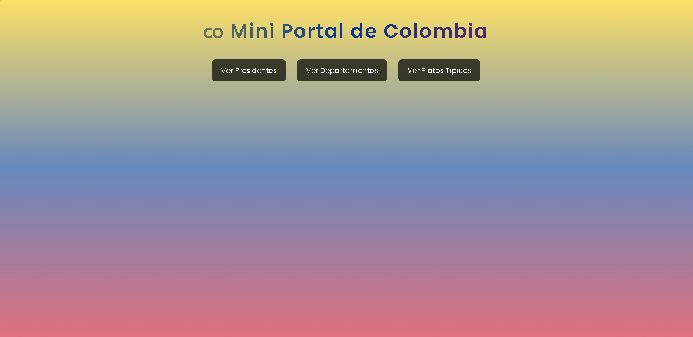
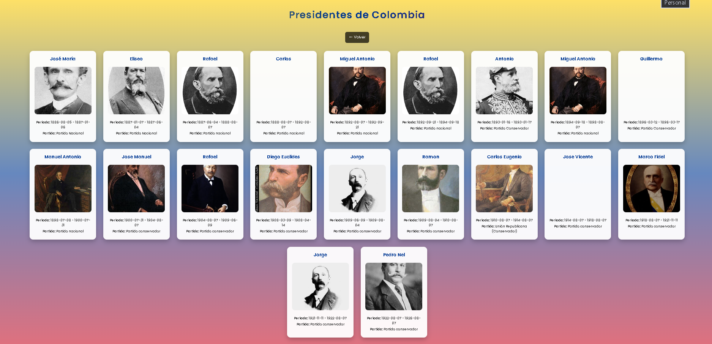
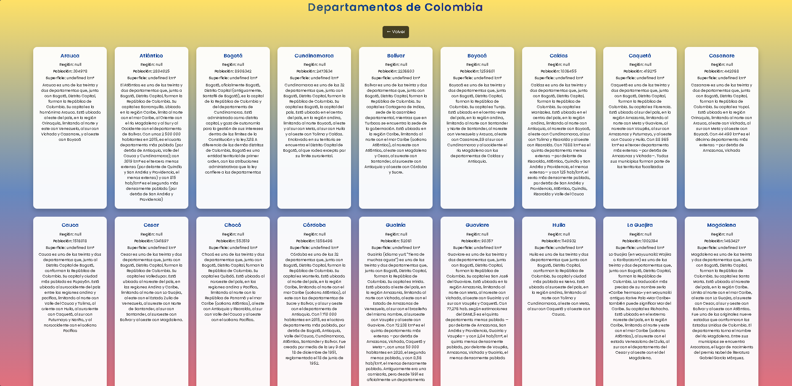
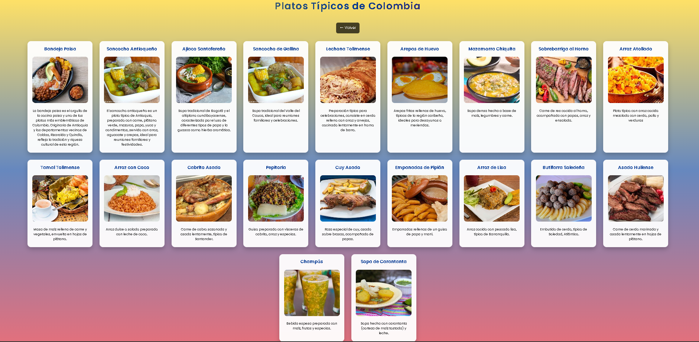

# Mini Portal de Colombia con API

## Descripción

Este proyecto es un mini portal web informativo sobre Colombia que consume datos desde la API pública:
https://api-colombia.com/

El sitio permite visualizar información de manera dinámica en el DOM utilizando JavaScript.
Incluye diferentes secciones como departamentos, platos típicos y presidentes de Colombia.

---

## Funcionalidades

* Visualización de departamentos de Colombia
* Listado de platos típicos con imágenes
* Información de presidentes (con API)
* Consumo de datos con `fetch`
* Renderizado dinámico en el DOM
* Mensaje de carga mientras se obtienen datos
* Manejo de errores

---

## Tecnologías usadas

* HTML5
* CSS3
* JavaScript (Vanilla JS)
* API REST (https://api-colombia.com/)

---

## Estructura del proyecto

```
/proyecto
│
├── index.html
├── departamentos.html
├── platos.html
├── presidentes.html
│
├── css/
│   └── estilos.css
│
├── js/
│   ├── departamentos.js
│   ├── platos.js
│   └── presidentes.js
│
└── img/
    └── (imágenes de platos y default.jpg)
```

---

## Instrucciones de uso

1. Descargar o clonar el repositorio
2. Abrir el archivo `index.html` en el navegador
3. Navegar entre las secciones usando los enlaces

---

## Consideraciones

* Algunas imágenes de la API pueden no funcionar, por lo que se utilizaron imágenes locales como respaldo
* Se implementó manejo de errores para evitar fallos en la carga de datos

---

## Autor

Nombre del estudiante: Ruben Carreno

---

## Capturas 











